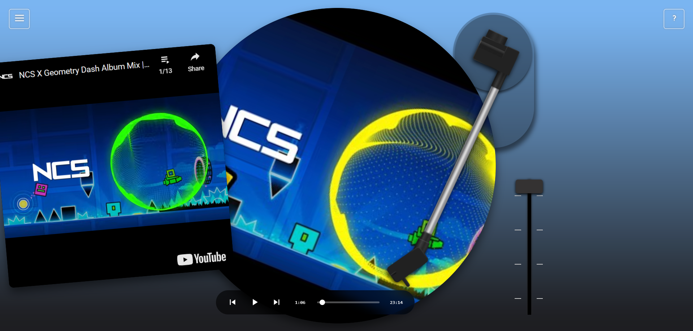

# BluePeak Vinyl Player 🎵

A web-based vinyl record player interface that plays local files and direct audio URLs. Designed with a focus on privacy, offline capability, and a retro listening experience.



## 🌐 Try It Online

The app is hosted at: **https://bluepeakvinylplayer.vercel.app/**

## 🚀 How to Run Locally

Running locally bypasses most browser security restrictions and gives you full control.

### Option 1: Quick start with npx (no install needed)

```bash
npx http-server . -p 8080 -c-1
```

Then open **http://localhost:8080** in your browser.

### Option 2: Install and run with npm

```bash
npm install
npm start
```

Then open **http://localhost:8080**.

### Option 3: Any static file server

```bash
# Python
python3 -m http.server 8080

# PHP
php -S localhost:8080
```

## 🔧 Architecture & How It Works

### Project Structure

```
├── index.html              # Main app entry point
├── css/
│   └── styles.css          # All styling (vinyl, animations, glass mode)
├── js/
│   ├── main.js             # App bootstrap
│   ├── services/
│   │   ├── VinylPlayer.js  # Core player logic, UI, queue management
│   │   ├── PlaylistManager.js # Queue/playlist data management
│   │   ├── ExportEngine.js # 4K video export
│   │   ├── HolidayManager.js # Holiday-themed music detection
│   │   ├── i18n.js         # Internationalization (15 languages)
│   │   └── ...
│   ├── ffmpeg.js           # FFmpeg WASM for audio processing
│   └── jsmediatags.js      # Local file metadata reading
├── manifest.json           # PWA manifest
└── service-worker.js       # Offline support
```

### Key Features

- **🎵 Multiple Sources** — Local files, direct audio URLs
- **💿 Vinyl Record UI** — Animated vinyl with rotating cover art, draggable tone arm
- **📋 Queue Management** — Drag-and-drop reorder, remove tracks, persistent queue
- **🎚️ Audio Processing** — Built-in FFmpeg for metadata extraction, MP3 conversion, trimming
- **📺 4K Video Export** — Export animated vinyl visualizations with audio
- **🌍 i18n** — 15 languages supported
- **📱 PWA Ready** — Install as a standalone app on desktop/mobile
- **🔄 Playback Speed** — 0.25x to 5x speed control
- **📖 Chapter Support** — Audiobook chapter navigation for M4B files, manual timestamp tracklists
- **✅ 80+ Format Support** — Comprehensive audio & video format acceptance with validation

## 🛠️ Development

### Prerequisites

- A modern browser (Chrome, Firefox, Edge, Safari)
- Node.js (optional, for npm-based serving)

### Local Development

```bash
# Clone the repo
git clone <https://github.com/jdjchelp-jpg/vinylplayer>
cd vinyl-player

# Serve locally
npx http-server . -p 8080 -c-1
```

## 📜 License

This project is licensed under the **GNU General Public License v3.0** (GPLv3). See the [LICENSE](LICENSE) file for details.

### Supported Formats

The player accepts a wide range of audio and video file formats. Paste a timestamp tracklist to add chapter navigation to any track.

| Category | Formats |
|----------|----------|
| **Audio (Recommended)** | `.mp3` `.flac` `.wav` `.ogg` `.opus` `.m4a` `.aac` |
| **Audio (Extended)** | `.aiff` `.aif` `.wma` `.alac` `.ac3` `.ape` `.wv` `.tta` `.mpc` `.mp2` |
| **Audiobooks** | `.m4b` `.m4p` `.mid` `.midi` `.mod` `.s3m` `.xm` `.it` |
| **Video (Recommended)** | `.mp4` `.webm` `.mkv` `.mov` `.m4v` |
| **Video (Extended)** | `.avi` `.wmv` `.ts` `.mts` `.m2ts` `.vob` `.mpg` `.mpeg` `.ogv` `.flv` `.3gp` `.asf` `.rm` `.rmvb` `.divx` `.xvid` `.bik` `.nsv` `.wtv` |

### Adding Chapters via Timestamps

Load a track, then use **Add Chapters** from the menu to paste a tracklist:

```
0:00 -  Song Title - Artist Name
4:28 -  Song Title - Artist Name
6:36 -  Song Title - Artist Name
```

Chapters will appear in the chapter menu and chapter pill, letting you jump between songs in a mix.

## 🤝 Contributing

Contributions are welcome! Feel free to:

- Open an issue for bugs or feature requests
- Submit a pull request with improvements
- Improve the UI or add new visual effects

## 🔗 Links

- **Live App:** https://bluepeakvinylplayer.vercel.app/
- **Report Issue:** https://forms.gle/xySxypnKc1x5aVZH6
